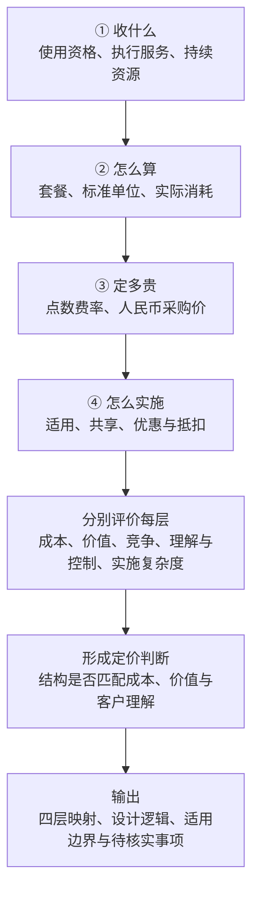
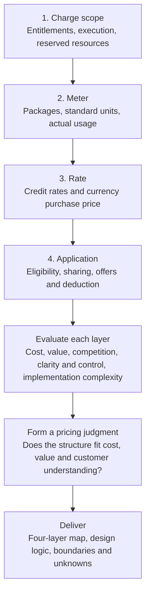
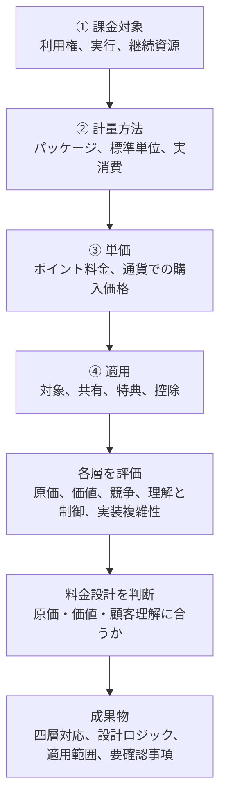

# 四层逻辑图 / Four-layer diagrams / 四層の図

## 简体中文

```mermaid
flowchart TD
    A[① 收什么<br/>使用资格、执行服务、持续资源] --> B[② 怎么算<br/>套餐、标准单位、实际消耗]
    B --> C[③ 定多贵<br/>点数费率、人民币采购价]
    C --> D[④ 怎么实施<br/>适用、共享、优惠与抵扣]
    D --> E[分别评价每层<br/>成本、价值、竞争、理解与控制、实施复杂度]
    E --> F[形成定价判断<br/>结构是否匹配成本、价值与客户理解]
    F --> G[输出<br/>四层映射、设计逻辑、适用边界与待核实事项]
```

## English

```mermaid
flowchart TD
    A[1. Charge scope<br/>Entitlements, execution, reserved resources] --> B[2. Meter<br/>Packages, standard units, actual usage]
    B --> C[3. Rate<br/>Credit rates and currency purchase price]
    C --> D[4. Application<br/>Eligibility, sharing, offers and deduction]
    D --> E[Evaluate each layer<br/>Cost, value, competition, clarity and control, implementation complexity]
    E --> F[Form a pricing judgment<br/>Does the structure fit cost, value and customer understanding?]
    F --> G[Deliver<br/>Four-layer map, design logic, boundaries and unknowns]
```

## 日本語

```mermaid
flowchart TD
    A[① 課金対象<br/>利用権、実行、継続資源] --> B[② 計量方法<br/>パッケージ、標準単位、実消費]
    B --> C[③ 単価<br/>ポイント料金、通貨での購入価格]
    C --> D[④ 適用<br/>対象、共有、特典、控除]
    D --> E[各層を評価<br/>原価、価値、競争、理解と制御、実装複雑性]
    E --> F[料金設計を判断<br/>原価・価値・顧客理解に合うか]
    F --> G[成果物<br/>四層対応、設計ロジック、適用範囲、要確認事項]
```
